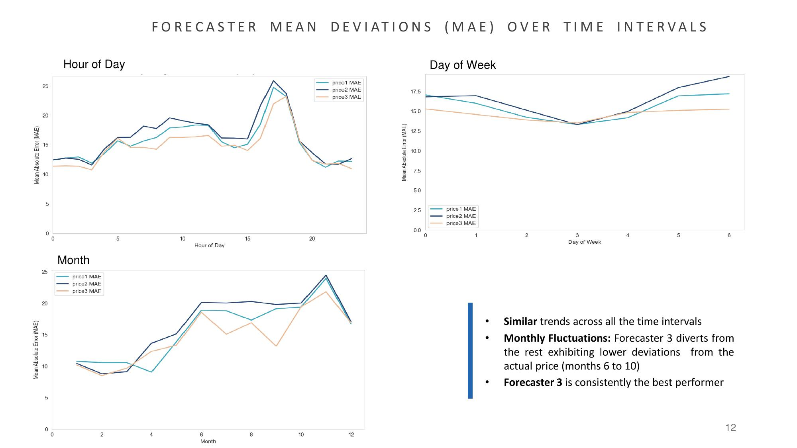
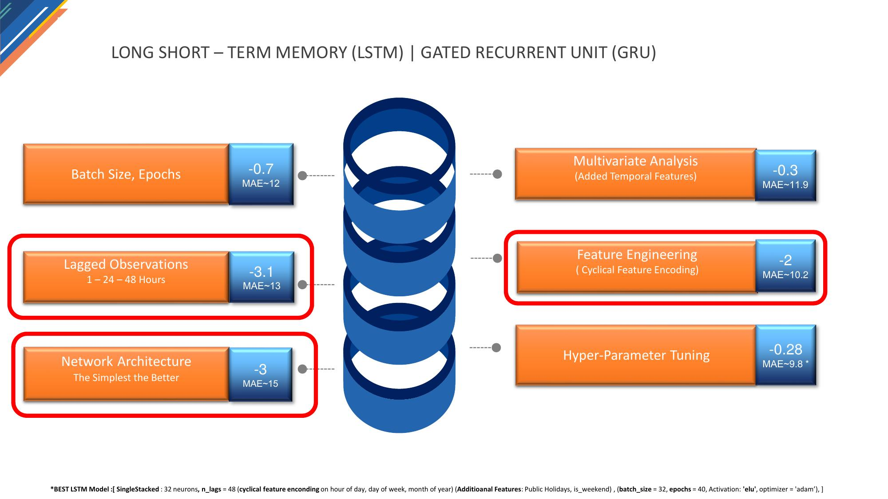
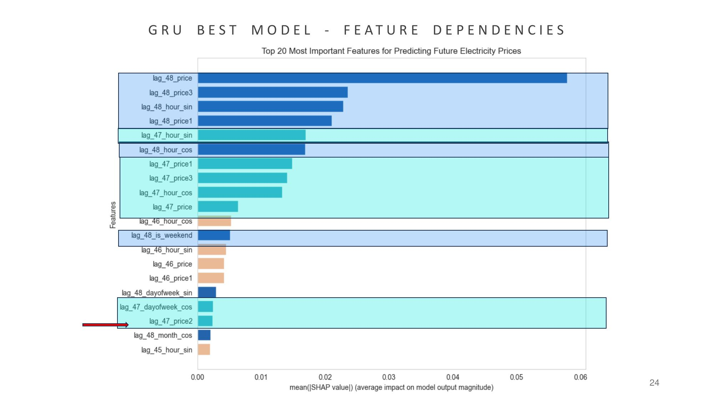

# Optimizing Next-Day Energy Price Predictions with Deep Learning & Gradient Boosting

A short-term data science consulting engagement with **Big Blue Data Academy** and **PPC** (Public Power Corporation), delivering machine learning models to forecast next-day hourly energy prices.

**The business challenge:** PPC's Short-Term Market Analysis Unit receives next-day price forecasts from three independent external forecasters. The goal was to build a model on top of these forecasts — effectively *a prediction on top of a prediction* — using the forecasters' historical predictions alongside actual historical prices to produce a more accurate forecast than any single provider alone. A secondary goal was to evaluate and compare how each of the three forecasters behaved at the hourly, daily, and monthly level.

**Duration:** 1 month
**Participants:** Katerina Psallida, Kostas Tsagkaropoulos

## Results

| | Forecaster 1 | Forecaster 2 | Forecaster 3 | LightGBM | LSTM | GRU |
|---|---|---|---|---|---|---|
| **MAE** | 15.53 | 16.33 | 14.61 | 11.87 | 9.84 | **9.78** |

The best recurrent model (GRU) reduced Mean Absolute Error by **~33% relative to the strongest individual external forecaster** (14.61 → 9.78), and outperformed a tuned LightGBM gradient boosting baseline as well.

**Why MAE:** chosen as the evaluation metric across all algorithms because, by relying on absolute value, it treats over- and under-estimation equally — and it's a metric widely used and understood in the energy sector specifically.


## Tech Stack

- **Language:** Python
- **Data manipulation:** pandas, NumPy
- **Regression & time series:** LightGBM, ARIMA, Prophet
- **Deep learning:** TensorFlow / Keras — LSTM, GRU, SimpleRNN, Bidirectional, and Conv1D layers, with Dropout and BatchNormalization for regularization
- **Hyperparameter tuning:** GridSearchCV via scikeras, wrapping Keras models as scikit-learn estimators for systematic architecture and parameter search
- **Training optimization:** EarlyStopping and ReduceLROnPlateau callbacks to prevent overfitting and adapt the learning rate during training
- **Explainability:** SHAP, applied to the best GRU model to interpret feature-level contributions to price predictions
- **Time series diagnostics:** ACF/PACF plots (statsmodels) to identify lag dependencies and inform sequence window design
- **Preprocessing:** scikit-learn (StandardScaler, MinMaxScaler, OneHotEncoder, ColumnTransformer)
- **Visualization:** matplotlib, seaborn, Plotly
- **Experiment tracking:** Neptune.ai
- **Model persistence:** pickle

## Project Organization

```
├── README.md       <- The top-level README for navigating this project
├── Data            <- Actual hourly PPC energy prices and forecasted prices from 3 external providers
├── DataANDMerging  <- Notebooks for building one unified target file: merging, joining, interpolating missing timestamps
├── EDA             <- Notebooks for Exploratory Data Analysis
├── Notebooks RNN   <- Jupyter notebooks for training RNN architectures and generating next-hour price predictions
├── PPC ENV RNN     <- Environment configuration for running RNN models
├── Presentation    <- Presentation walking through the project and final conclusions
```

## My Contribution: Forecaster Analysis & RNN Modeling

I led two parts of this project: the comparative forecaster analysis in the EDA phase, and the full recurrent neural network modeling and evaluation pipeline (the regression and classical time series work — LightGBM, ARIMA, Prophet — was my teammate Kostas's contribution).

### Forecaster Comparison Analysis

Before any modeling began, I analyzed how each of the three external forecasters' errors behaved across different time granularities — by hour of day, day of week, and month — both to understand each provider's reliability and to see whether any forecaster had a structural edge worth exploiting.



Key findings:
- **Consistent structural pattern across all three forecasters** — error spikes sharply around hour 17 (evening demand ramp-up) and stays low overnight, regardless of which forecaster is used
- **Weekly pattern:** all three forecasters show their lowest error mid-week, rising toward the weekend
- **Forecaster 3 diverges seasonally** — it shows notably lower deviation than the other two specifically in months 6–10, and is the **consistently best-performing forecaster** overall (MAE 14.61), while **Forecaster 2 is consistently the weakest** (MAE 16.33, the most divergent from actual prices)

Rather than discarding the weaker forecasters, all three were retained as ensemble input features for modeling, since their errors weren't perfectly correlated — giving the downstream models complementary signal. As the SHAP analysis below confirms, the models actually *learned* this reliability difference on their own.

### RNN Modeling: LSTM vs. GRU

I experimented with two closely related recurrent architectures, chosen specifically for their different strengths:

- **LSTM** — preferred where long-term dependencies matter, such as language modeling or time series with long-running trends
- **GRU** — a lighter-weight sibling architecture: it has somewhat less capacity to retain long-term memory, but trains faster and needs fewer computational resources

Both were evaluated to determine which trade-off suited this dataset better.

### Iterative Improvement Process

Rather than tuning a single model in one pass, I approached development as a series of measured experiments, tracking the MAE impact of each change:



| Change | MAE Impact |
|---|---|
| **Network architecture simplification** | **−3.0** |
| **Lagged observations (1, 24, 48 hours)** | **−3.1** |
| Batch size/epoch tuning + added temporal features (hour, week, month, holiday, weekend flags) | −1.0 combined |
| **Cyclical feature encoding** | **−2.0** |
| Hyperparameter tuning | −0.28 |

Two findings stood out during this process:

- **"The simplest is better."** These architectures are highly sensitive to design choices — number of neurons, whether to add a second stack, dropout between layers, intermediate normalization. More complex configurations consistently produced *worse* results (MAE ~18) than one or two simple neuron layers with no intermediate stages (MAE ~15) — a direct signal that added complexity was letting the model learn from noise rather than signal.
- **Cyclical feature encoding produced a surprisingly large jump** in performance (−2.0 MAE) for a relatively simple transformation — confirmation that giving the model an explicitly periodic representation of time mattered more than expected.

Architecture simplification, lagged observations, and cyclical encoding were, by a clear margin, the three highest-impact changes in the entire process.

### Best Model Configurations

- **LSTM:** single stacked layer, 32 neurons, MinMaxScaler(0,1), `n_lags=48`, `batch_size=32`, `epochs=40`, activation `elu`, optimizer `adam` — with cyclical encoding on hour/day-of-week/month, plus public holiday and weekend flags
- **GRU (best overall):** two consecutive stacked GRU layers (units: 64, 128) followed by two Dense output layers (`elu` then `relu` activation), same lag window, scaling, and feature set as above

### Explainability: SHAP on the Best GRU Model

To understand *why* the model was making the predictions it did — not just that it performed well — I applied SHAP to the best GRU model, surfacing the top 20 most influential features:



The 48-hour lagged price (`lag_48_price`) was by far the most influential feature, followed closely by the cyclical hour encodings at that same lag — directly validating the cyclical time-encoding approach. Features are color-coded by recency: blue bars are 48-hour-lagged features, green bars are 47-hour-lagged features.

The most interesting finding: **Forecaster 2's value shows up as one of the least influential features in the model** — and this is not a coincidence. It's the model independently confirming exactly what the EDA had already shown: Forecaster 2 has the most divergent, least reliable predictions of the three, so the model learned, on its own, to weight it accordingly.

Beyond model transparency, this kind of analysis has real business value: knowing which time points and features drive predictions most can inform decisions in adjacent operational areas — promotional timing, inventory management, and preventive maintenance scheduling, among others.

## Data & Preprocessing

Consolidated multiple heterogeneous time series sources — actual hourly prices plus three independent forecaster predictions — into a single, temporally consistent target dataset. Applied interpolation to resolve short data gaps and cross-referenced supplementary PPC-provided files to fill larger missing intervals, ensuring continuity for downstream modeling.

## Exploratory Data Analysis

- Monthly and hourly analysis of average actual energy prices, identifying seasonal and intraday demand patterns
- **ACF/PACF analysis** to diagnose autocorrelation structure and inform lag/sequence window selection for the RNN models
- Comparative deviation analysis benchmarking each of the three forecasters against ground-truth actual prices (see "Forecaster Comparison Analysis" above)
- Investigation of correlations between major global events and energy price volatility

## Conclusions

We were able to deliver an algorithm that provides more precise next-day energy price predictions by leveraging forecasts from all three external providers as ensemble input features, rather than relying on any single provider. Both recurrent architectures (LSTM, GRU) outperformed all three external forecasters individually, as well as a tuned LightGBM baseline — with network architecture, lagged observations, and cyclical feature encoding driving the majority of that improvement.

**Future work** could incorporate additional lagged features — such as weather and seasonal data — to further enhance the robustness of the analysis.
