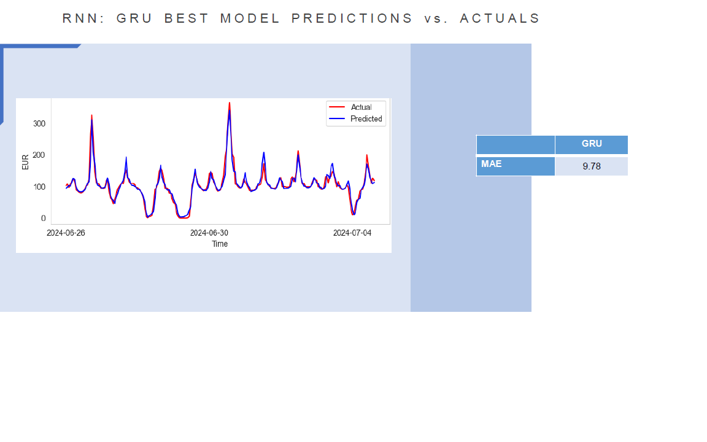

# Optimizing Next-Day Energy Price Predictions with Deep Learning & Gradient Boosting

A short-term data science consulting engagement with **Big Blue Data Academy** and **PPC** (Public Power Corporation), delivering machine learning models to forecast next-day hourly energy prices. The solution ensembles predictions from three independent third-party forecasters with historical price data, feeding both classical gradient boosting and recurrent neural network architectures — supporting PPC's Short-Term Market Analysis Unit in improving 24-hour price forecast precision.

**Duration:** 1 month
**Participants:** Katerina Psallida, Kostas Tsagkaropoulos

## Results

| | Forecaster 1 | Forecaster 2 | Forecaster 3 | LightGBM | LSTM | GRU |
|---|---|---|---|---|---|---|
| **MAE** | 15.53 | 16.33 | 14.61 | 11.87 | 9.84 | **9.78** |

The best recurrent model (GRU) reduced Mean Absolute Error by **~33% relative to the strongest individual external forecaster** (14.61 → 9.78), and outperformed a tuned LightGBM gradient boosting baseline as well. This demonstrates that treating forecaster outputs as engineered ensemble features — rather than relying on any single provider — meaningfully improves forecast accuracy.



## Tech Stack

- **Language:** Python
- **Data manipulation:** pandas, NumPy
- **Gradient boosting:** LightGBM
- **Deep learning:** TensorFlow / Keras — LSTM, GRU, SimpleRNN, Bidirectional, and Conv1D layers, with Dropout and BatchNormalization for regularization
- **Hyperparameter tuning:** GridSearchCV via scikeras, wrapping Keras models as scikit-learn estimators for systematic architecture and parameter search
- **Training optimization:** EarlyStopping and ReduceLROnPlateau callbacks to prevent overfitting and adapt the learning rate during training
- **Time series diagnostics:** ACF/PACF plots (statsmodels) to identify lag dependencies and inform sequence window design
- **Preprocessing:** scikit-learn (StandardScaler, MinMaxScaler, OneHotEncoder, ColumnTransformer)
- **Visualization:** matplotlib, seaborn, Plotly
- **Experiment tracking:** Neptune.ai
- **Model persistence:** pickle

## Project Organization

```
├── README.md       <- The top-level README for navigating this project
├── Data            <- Actual hourly PPC energy prices and forecasted prices from 3 external providers
├── DataANDMerging  <- Notebooks for building one unified target file: merging, joining, interpolating missing timestamps
├── EDA             <- Notebooks for Exploratory Data Analysis
├── Notebooks RNN   <- Jupyter notebooks for training RNN architectures and generating next-hour price predictions
├── PPC ENV RNN     <- Environment configuration for running RNN models
├── Presentation    <- Presentation walking through the project and final conclusions
```

## Data & Preprocessing

Consolidated multiple heterogeneous time series sources — actual hourly prices plus three independent forecaster predictions — into a single, temporally consistent target dataset. Applied interpolation to resolve short data gaps and cross-referenced supplementary PPC-provided files to fill larger missing intervals, ensuring continuity for downstream modeling.

## Exploratory Data Analysis

- Monthly and hourly analysis of average actual energy prices, identifying seasonal and intraday demand patterns
- **ACF/PACF analysis** to diagnose autocorrelation structure and inform lag/sequence window selection for the RNN models
- Comparative deviation analysis benchmarking each of the three forecasters against ground-truth actual prices
- Investigation of correlations between major global events and energy price volatility

## Modeling: Recurrent Neural Networks

Key feature engineering and architecture decisions:

- **Cyclical time encoding:** transformed hour, day-of-week, and month using sine/cosine functions, preserving periodicity so the network could learn recurring temporal patterns rather than treating time as linear
- **Exogenous flags:** incorporated holiday and weekend indicators as additional inputs
- **Architecture search:** systematically compared RNN cell types (SimpleRNN, LSTM, GRU) and Bidirectional wrappers, alongside Conv1D layers, using GridSearchCV (via scikeras) to tune architecture and hyperparameters as scikit-learn-compatible estimators
- **Sequence design:** informed by ACF/PACF diagnostics, experimented with lag windows (periodicity dependency), batch size, and epoch count
- **Training stability:** applied EarlyStopping and ReduceLROnPlateau to prevent overfitting and dynamically adjust the learning rate
- **Experiment tracking:** logged and compared all training runs via Neptune.ai, enabling systematic comparison across architecture and hyperparameter variations

## Conclusions

Both recurrent architectures outperformed all three external forecasters individually, as well as a tuned LightGBM baseline — demonstrating that a deep learning approach leveraging multiple forecaster inputs as engineered features can meaningfully improve short-term energy price forecasting accuracy over relying on any single provider's predictions.
